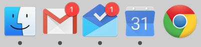

# Google Inbox packaged as Electron app

This is a thin wrapper around the Google Inbox web interface built on
[Electron](http://electron.atom.io/).



## Features

* Native desktop notifications
* Unread messages badge in OS X dock
* Native spell checking
* Dark sidebar theme

## Building

```
npm install
npm run pack-osx
cp -r Inbox-darwin-x64/Inbox.app /Applications
```

# License

The code in this repository has been released to the public domain
under the [UNLICENSE](./UNLICENSE).

# Disclaimer

This project is not affiliated with, associated to, nor endorsed by Google
in any way. Google, Inbox by Gmail and the Google Inbox Logo are registered
trademarks of Google Inc.
